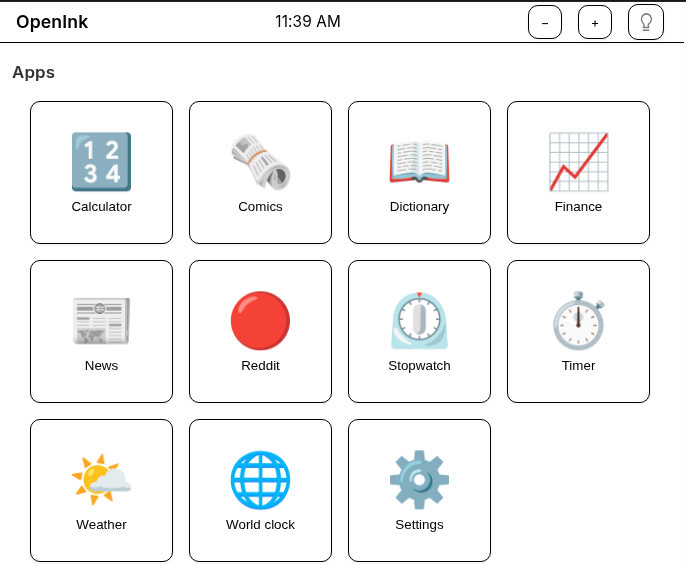
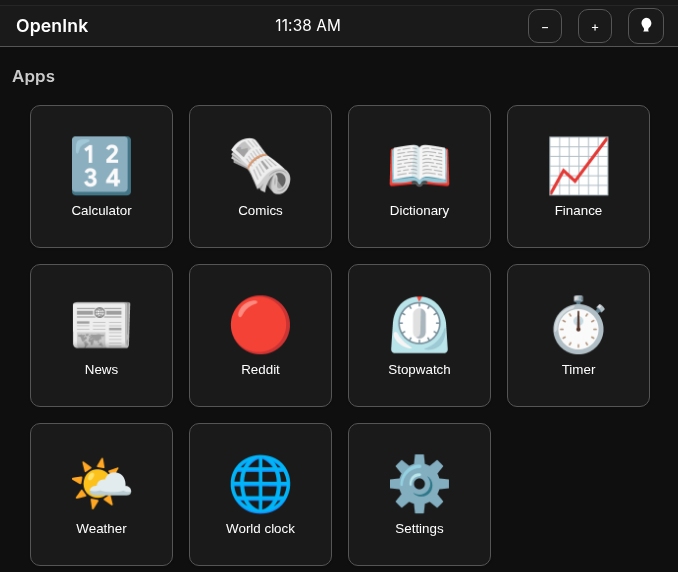

# OpenInk

A minimal, plugin-based “webOS-style” environment for low-spec e-ink devices. It provides a home screen, launcher, and a set of built-in apps that run inside a shared shell.

### Light and dark mode

| Light mode | Dark mode |
|------------|-----------|
|  |  |

Toggle appearance from the status bar (light bulb icon). Use **+** / **−** in the status bar to zoom for resolution fit. The same Apps and Games launcher is available in both themes.

### Demo

<!-- Inline playback: 1) On GitHub, open this README and click Edit. 2) Download docs/demo-screencast.mp4 from the repo (or use your local copy). 3) Drag-and-drop the MP4 file onto the line below. 4) Save. GitHub will replace it with a playable embed (max 10 MB). -->

https://github.com/user-attachments/assets/1a1e025f-053a-4fa5-92ef-d9c765a25204


*The lengthy black flicker mocks the E-Ink refresh.


## Tech stack

- **TypeScript** (strict, no implicit any)
- **Preact** (lightweight React alternative)
- **Vite** (build and dev server)
- **Plain CSS** (no Tailwind or CSS-in-JS)

## Running the project

```bash
npm install
npm run dev
```

Then open the URL shown (e.g. `http://localhost:5173`) in a browser. The dev server listens on all interfaces, so you can also use your machine’s LAN address (e.g. `http://192.168.1.5:5173`) from another device on the same network.

**E-ink demo (testing):** Open `/demo/eink-demo.html` (e.g. [http://localhost:5173/demo/eink-demo.html](http://localhost:5173/demo/eink-demo.html)) to run the app in a B&W mock reader: drag the corner to resize, simulated e-ink refresh every 3–4 navigations (or on a timer). See **[docs/DEMO.md](docs/DEMO.md)** for details.

**Build for production:**

```bash
npm run build
npm run preview   # optional: preview the built app
```

**Lint and tests:**

```bash
npm run lint
npm test
```

## Adding a new app / plugin

1. Create a folder under `src/apps/<app-id>/` and implement the `WebOSApp` interface (see `src/apps/dictionary/` or `src/apps/comics/`).
2. Register the app in `src/apps/registry.ts` by adding a descriptor and lazy loader to the `LAZY_APPS` array (e.g. `load: () => import('./your-app').then(m => m.yourApp)`).

Full steps and how to use shared services and respect global settings are in **[docs/plugins.md](docs/plugins.md)**.

## Built-in apps (v1)

- **Settings** – Pixel optics, font size, theme, appearance.
- **Calculator** – Basic arithmetic; offline.
- **Games** – Chess (local 2p or vs computer), Sudoku, Minesweeper, Racing (discrete-tick, e-ink friendly).
- **News** – RSS reader with multiple sources, CORS proxy, source labels, date-sorted mix.
- **Reddit** – Read-only subreddit and post list with paginated comments.

  Choose a subreddit from the list or open one by name, then browse posts and comments (dark mode shown below).

  | Subreddit picker | Post list |
  |------------------|-----------|
  |  |  |

- **Finance** – Markets: S&P 500, Gold, Bitcoin, Ethereum with 24h change; USD/EUR toggle and Refresh.

  

- **Comics** – xkcd (by number, Older/Newer) and Comics RSS (curated strips from comicsrss.com). Cached; no animation.

- **Weather**, **Timer**, **Stopwatch**, **World clock**, **Dictionary** – Widgets and utilities (offline or cached where possible).

## Performance & e-ink (low-spec first)

The site is tuned for **slow hardware, grayscale e-ink, and low refresh rates**:

- **No animation loops** – No `requestAnimationFrame`; updates are discrete (StatusBar 60s, Timer/Stopwatch/World clock 1s, Racing 500ms).
- **Reduced motion** – When `prefers-reduced-motion: reduce`, all transitions and decorative shadows are disabled to cut repaints.
- **Containment** – Shell, app content, and home sections use `contain: layout style` to limit reflow/repaint scope.
- **Light JS** – Memoized app lists and paginated slices; event delegation on the home grid; minimal work per render.
- **Readability** – Large tap targets (`--tap-min`), high-contrast theme option, grayscale-first palette.
- **Installable** – [Web app manifest](public/manifest.json) for “Add to Home Screen” on supported browsers and e-ink devices.

## Security (public deployment)

For a site that anyone can access, the app is built with security in mind: no secrets in the bundle, sanitized API content (XSS prevention), Content-Security-Policy, and safe storage usage. **Serve over HTTPS** and set security headers at your host. See **[docs/SECURITY.md](docs/SECURITY.md)** for details and deployment checklist.

## Known limitations (e-ink and low-spec)

- **Refresh rate** – UI avoids rapid updates and heavy animations; transitions are minimal or instant.
- **Grayscale** – Default theme is monochrome; color mode adds subtle accents only.
- **Touch** – Large tap targets; no drag gestures; pagination instead of infinite scroll where applicable.
- **Performance** – No animation libraries; DOM kept simple; apps should avoid continuous timers and heavy re-renders.
- **Browser app** – Reader mode uses heuristic extraction; CORS may block some sites; no iframe sandbox in this version.
- **Reddit/News** – Require network; rate limits and CORS apply; offline fallback is limited to cached data.

## Documentation

- **[CONTRIBUTING.md](CONTRIBUTING.md)** – How to run, test, and contribute.
- **[docs/SECURITY.md](docs/SECURITY.md)** – Security measures and deployment checklist for public sites.
- **[docs/ARCHITECTURE.md](docs/ARCHITECTURE.md)** – High-level design: shell, plugin system, services, and data flow.
- **[docs/DEVELOPMENT.md](docs/DEVELOPMENT.md)** – Development workflow, project structure, adding services, testing, and deploy.
- **[docs/DEMO.md](docs/DEMO.md)** – E-ink demo page: how to open it, controls, and how the simulated refresh works.
- **[docs/plugins.md](docs/plugins.md)** – How to build and register app plugins, use context and services, and optional shell integration (getTitle, canGoBack, goBack).

## Project structure

- `src/core/kernel/` – Shell, home screen, app lifecycle.
- `src/core/plugins/` – Plugin registry.
- `src/core/services/` – Storage, network, theme, settings.
- `src/core/ui/` – Core UI (StatusBar, PageNav, Button, List).
- `src/core/utils/` – Shared helpers (e.g. stripHtml).
- `src/apps/` – App plugins (e.g. settings, finance, games, news, reddit, comics, timer, stopwatch, worldclock, dictionary).
- `src/types/` – Shared types and plugin API.
