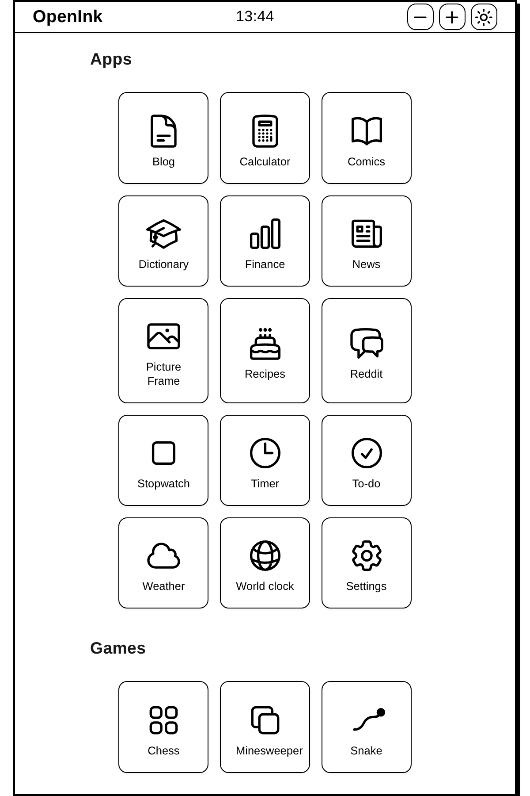
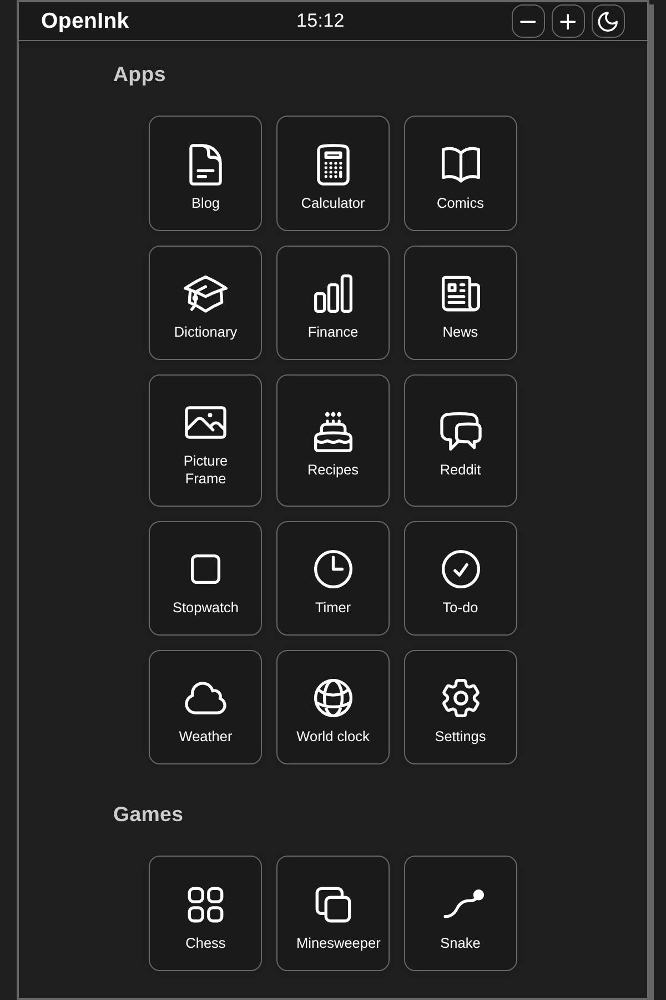
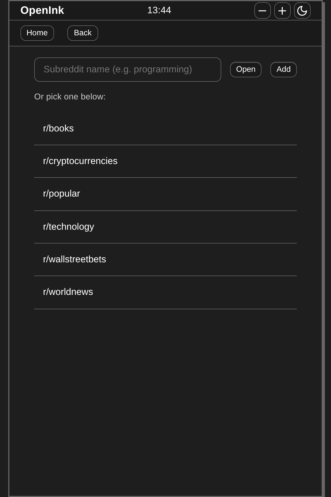
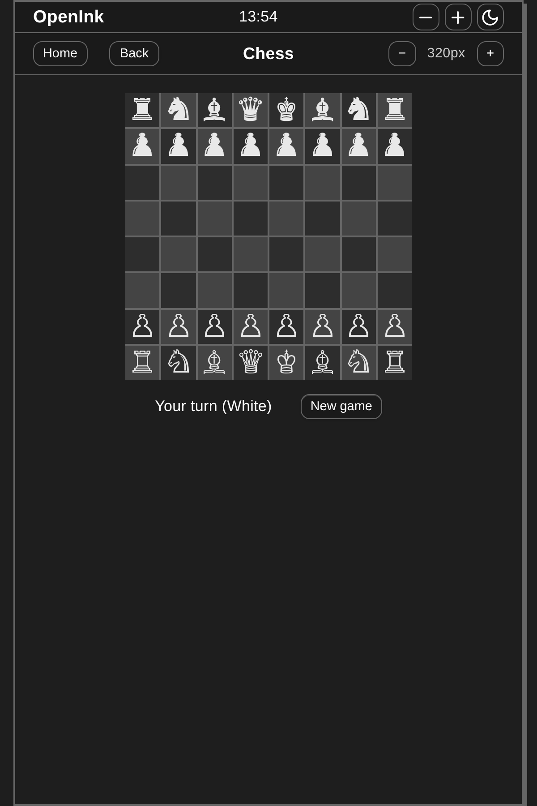

# OpenInk

A minimal, plugin-based “webOS-style” launcher for low-spec and e-ink devices. It provides a home screen, status bar, and a set of built-in apps that run inside a shared shell—tuned for Kindle, grayscale displays, and slow hardware.

## Features

- **Home screen** – Apps and Games sections; tap any tile to open an app. In **Settings → Home** you can set **apps per row** to 2, 3, or 4 (or Auto). Touch and click both supported for reliable launch on Kindle. Extra side padding gives a scroll gutter so swiping doesn’t open apps by mistake. Scroll-vs-tap detection ignores taps when the pointer has moved (reduces accidental launches on Kindle).
- **Status bar** – Zoom (+ / −), theme toggle (light/dark), clock (optional), compact controls.
- **Single-page legacy build** – One HTML file and one JS bundle (no ES modules), so it runs on Kindle, Silk, and other no-ESM browsers. Black-and-white SVG icons where needed.

| Light mode | Dark mode |
|------------|-----------|
|  |  |

| Reddit widget | Chess (in-game) |
|---------------|-----------------|
|  |  |

Screenshots show the home screen in light and dark mode (with **3 apps per row**), the Reddit app, and the Chess game. To regenerate: `npm run build` then `npm run screenshot`. Requires [Playwright](https://playwright.dev/) — run `npx playwright install chromium` once if needed (use `PLAYWRIGHT_BROWSERS_PATH=$HOME/.cache/ms-playwright` if browsers are installed in user cache).

## Tech stack

- **TypeScript** (strict)
- **Preact** (lightweight React alternative)
- **Vite** (build and dev server)
- **Plain CSS** (no Tailwind or CSS-in-JS)

## Quick start

```bash
npm install
npm run dev
```

Open the URL shown (e.g. `http://localhost:5173`). The dev server listens on all interfaces, so you can use your machine’s LAN address from another device.

**Production / Kindle:**

```bash
npm run build
```

Deploy the full `dist/` (single `index.html` and `assets/`). See **[docs/COMPATIBILITY.md](docs/COMPATIBILITY.md)** for deployment and troubleshooting.

```bash
npm run preview   # optional: preview the built app
npm run lint
npm test
```

## Built-in apps

- **Settings** – Pixel optics, font size, theme, appearance, **home layout (apps per row: 2, 3, or 4)**, subreddit list, CORS proxy, and more.
- **Calculator** – Basic arithmetic; offline.
- **Chess** – Two players or vs computer. Full rules: castling, en passant, pawn promotion to queen, queen and rook captures along ranks and files, checkmate and stalemate. Stockfish (WASM) is used when the browser supports Web Workers and WebAssembly; if Stockfish fails to load or respond, the built-in fallback engine is used so vs computer still works (e.g. on legacy/Kindle).
- **Snake** – Classic snake: arrow keys or on-screen D-pad, pause, score. Touch-friendly for e-ink.
- **Sudoku** – Puzzle game.
- **Minesweeper** – Classic minesweeper.
- **Reddit** – Read-only subreddit and post list with paginated comments. Choose a subreddit from the list or open by name. **Sort:** one header button cycles Hot → New → Best for the current subreddit.
- **News** – RSS reader, multiple sources, CORS proxy, date-sorted mix.
- **Finance** – Markets: S&P 500, Gold, Bitcoin, Ethereum; 24h change; USD/EUR; refresh.
- **Comics** – xkcd (by number, Older/Newer) and Comics RSS (curated strips). Cached; no animation.
- **Blog** – RSS blog reader.
- **Dictionary** – Offline/cached lookups.
- **Weather** – Current and forecast (network).
- **Timer**, **Stopwatch**, **World clock** – Time utilities.
- **To-do** – Tasks with add/toggle/remove; stored locally.
- **Recipes** – Search TheMealDB; list and detail view; cached.
- **Picture Frame** – Slideshow of built-in images (landmarks, scenery, city sights); ‹ / › to change; Full screen with × to close. On legacy/Kindle only four local SVGs (no network). Optional keep-screen-on (modern only).

## Performance & e-ink

Tuned for **slow hardware, grayscale e-ink, and low refresh rates**:

- **No animation loops** – No `requestAnimationFrame`; discrete updates (e.g. StatusBar 60s, Timer/Stopwatch/World clock 1s).
- **Reduced motion** – When `prefers-reduced-motion: reduce`, transitions and decorative shadows are disabled.
- **Containment** – Shell, app content, and home sections use `contain: layout style` to limit reflow/repaint.
- **Touch-first** – Large tap targets (`--tap-min`), direct handlers on app tiles and key buttons for reliable tap on Kindle.
- **Readability** – High-contrast theme option, grayscale-first palette.
- **Installable** – [Web app manifest](public/manifest.json) for “Add to Home Screen” where supported.
- **Render efficiency** – Stable callbacks (e.g. shell Back button), memoized values (Snake board/set), and module-level icon components in the status bar to avoid unnecessary re-renders.

## Adding a new app

1. Create a folder under `src/apps/<app-id>/` and implement the `WebOSApp` interface (see `src/apps/dictionary/` or `src/apps/comics/`).
2. Register in `src/apps/registry.ts`: add a descriptor and lazy loader to `LAZY_APPS` (e.g. `load: () => import('./your-app').then(m => m.yourApp)`).

Details: **[docs/plugins.md](docs/plugins.md)**.

## Security (public deployment)

No secrets in the bundle; sanitized API content (XSS prevention); Content-Security-Policy; safe storage. The legacy fallback path uses a fixed error message (no user/error text in DOM) to avoid XSS. **Serve over HTTPS** and set security headers at your host. See **[docs/SECURITY.md](docs/SECURITY.md)**.

## Limitations

- **Refresh rate** – UI avoids rapid updates and heavy animations.
- **Grayscale** – Default theme is monochrome; color mode adds subtle accents.
- **Touch** – Large tap targets; no drag gestures; pagination instead of infinite scroll where applicable.
- **Reddit / News** – Require network; rate limits and CORS apply.

## Documentation

- **[CONTRIBUTING.md](CONTRIBUTING.md)** – Run, test, and contribute.
- **[docs/SECURITY.md](docs/SECURITY.md)** – Security and deployment checklist.
- **[docs/ARCHITECTURE.md](docs/ARCHITECTURE.md)** – Shell, plugin system, services, data flow.
- **[docs/DEVELOPMENT.md](docs/DEVELOPMENT.md)** – Workflow, structure, testing, deploy.
- **[docs/COMPATIBILITY.md](docs/COMPATIBILITY.md)** – Kindle/e-ink constraints and legacy loader.
- **[docs/plugins.md](docs/plugins.md)** – Building and registering apps, context, services, shell hooks.

## Project structure

- `src/core/kernel/` – Shell, home screen, app lifecycle, AppHeaderActionsContext.
- `src/core/plugins/` – Plugin registry (lazy load on first launch).
- `src/core/icons/` – App launcher icons: Heroicons (outline) in `app-icons.tsx`; legacy build uses `app-icons-legacy.ts` and `legacy-svg.ts`.
- `src/core/services/` – Storage, network, theme, settings.
- `src/core/ui/` – StatusBar, PageNav, Button, List, shared UI.
- `src/core/utils/` – html (stripHtml), url (isSafeUrl, sanitizeUrl), safe-svg (isSafeLegacySvg), date, fallback-ui.
- `src/apps/` – App plugins: settings, games (chess, snake, minesweeper), news, reddit, comics, blog, dictionary, finance, weather, timer, stopwatch, worldclock, todo, recipes, pictureframe.
- `src/apps/games/` – GameBoardResize (shared − / size / + header controls for Chess, Snake, Minesweeper).
- `src/types/` – Shared types and plugin API.

## License

See repository for license information.
